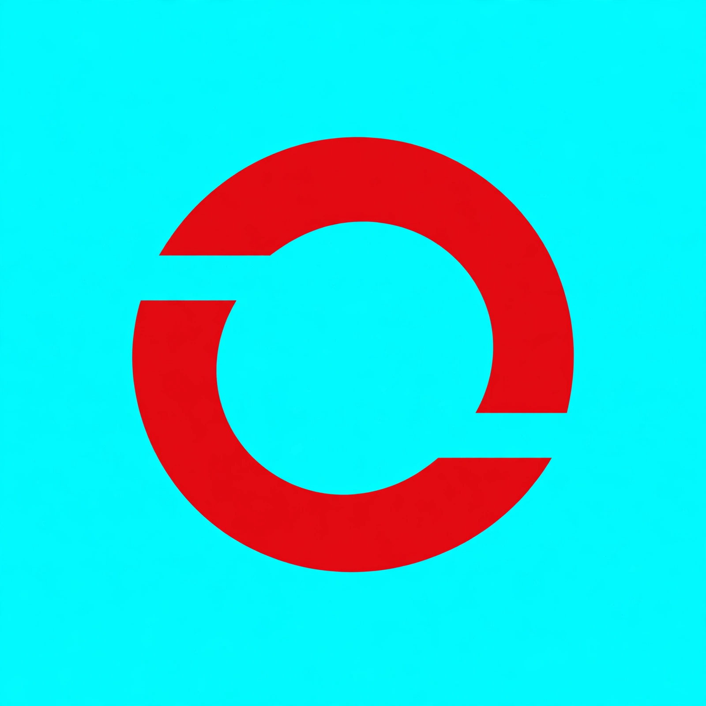

# Scarlite



Scarlite is a browser project built around **Phos**, a Rust HTML and CSS rendering engine. Phos loads local and HTTP(S) pages and renders them to SVG. The native window lives in [Scarlite-UI](https://github.com/saudaljuaid/Scarlite-UI); Phos remains headless.

## Try it

```sh
cargo run --locked --bin scarlite -- examples/welcome.html --output welcome.svg
cargo run --locked --bin scarlite -- https://example.com --output example.svg
```

## Features

Phos parses HTML, applies inline and linked CSS, and paints static SVG pages.
Its bounded text engine supports Unicode wrapping, bundled font fallback,
Arabic/Hebrew bidi and shaping, intrinsic sizing, Flexbox, Grid, responsive CSS,
relative/absolute positioning, gradients and outer shadows. Each has a documented
supported subset and explicit work limits.

## Documentation

See the [rendering subset and examples](docs/RENDERING.md) and
[engine status](docs/ENGINE_STATUS.md) for supported behavior and fixture counts.
[Browser comparisons](docs/BROWSER_COMPARISON.md) record geometry, remaining differences and timings.
The [cached document API](docs/CACHED_DOCUMENT.md) lets native embedders resize without refetching resources.
The [upstream fixture notes](tests/upstream/README.md) record parser sources and licenses.

## License

Apache 2.0. See [LICENSE](LICENSE).
